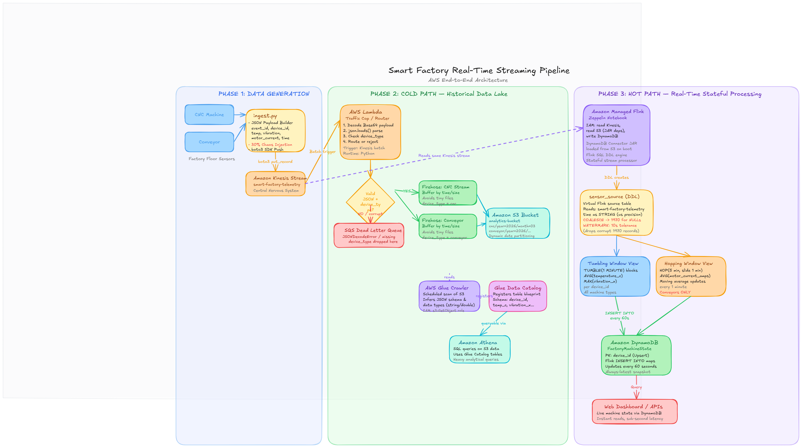

# Smart Factory Telemetry Data Architecture


## Executive Summary

The pipeline implements the industry-standard **Lambda Architecture** pattern, built primarily on Amazon Web Services (AWS). It captures real-time IoT telemetry from manufacturing equipment (CNC machines, Conveyors, and Temperature sensors) and routes it through two parallel tracks:

* **Speed Layer (Hot Path):** Delivers sub-second operational insights to live dashboards via Apache Flink and Amazon DynamoDB.
* **Batch Layer (Cold Path):** Archives immutable, clean telemetry data into an S3 Data Lake, processed through a Medallion Architecture using Databricks Lakehouse.

---

## Architecture Overview



### Core Technology Stack

* **Ingestion:** Python `boto3`, Amazon Kinesis Data Streams
* **Real-Time Stream Processing:** Amazon Managed Apache Flink (SQL), Amazon DynamoDB
* **Routing & Storage:** AWS Lambda, Amazon Kinesis Firehose, Amazon S3
* **Lakehouse Processing:** Databricks (Unity Catalog, Auto Loader, Delta Lake, CDF)
* **Resilience:** Amazon SQS (Dead Letter Queues) acting as the data lake's immune system

---

## Data Flow

1. **Ingest** — 100 simulated devices (50 CNC + 20 Conveyor + 30 Temperature) publish readings to Kinesis Data Streams, partitioned by zone (`zone-A`, `zone-B`, `zone-C`).
2. **Hot Path** — Amazon Managed Apache Flink runs SQL with 1-minute tumbling and 5-minute hopping windows, writing aggregated results to DynamoDB for live dashboards.
3. **Cold Path** — An AWS Lambda consumer validates each record and routes it to one of 3 Kinesis Firehose delivery streams (`cnc`, `conveyor`, `temperature`) for S3 storage. Malformed or unroutable records are sent to an SQS Dead Letter Queue.
4. **Bronze** — Databricks Auto Loader incrementally ingests raw JSON from S3 into Delta tables with schema evolution.
5. **Silver** — Data quality validation, deduplication by `event_id`, and enrichment (estimated power in watts, outlier flags, machine health status). Records failing DQ rules are routed to a quarantine table.
6. **Gold** — 1-hour window aggregations produce the `hourly_machine_summary` table with avg temperature, peak vibration, total power (kWh), and critical alert counts. Late-arriving data is handled via stateful MERGE upserts.

---

## Data Schema

The `SensorReading` dataclass defines the telemetry payload:

| Field | Type | Description |
|-------|------|-------------|
| `event_id` | `str` | UUID per reading |
| `device_id` | `str` | e.g. `cnc-001`, `conv-005`, `temp-012` |
| `device_type` | `str` | `cnc` \| `conveyor` \| `temperature` |
| `zone` | `str` | `zone-A` \| `zone-B` \| `zone-C` |
| `shift` | `str` | `morning` \| `afternoon` \| `night` |
| `event_time` | `str` | ISO 8601 device clock timestamp |
| `publish_time` | `str` | ISO 8601 wall clock at publish |
| `sequence_number` | `int` | Per-device monotonic counter |
| `vibration_x` | `float` | CNC: X-axis vibration (g) |
| `vibration_y` | `float` | CNC: Y-axis vibration (g) |
| `spindle_rpm` | `float` | CNC: spindle speed |
| `tool_wear_pct` | `float` | CNC: tool wear percentage |
| `belt_speed_mps` | `float` | Conveyor: belt speed (m/s) |
| `motor_current_amps` | `float` | Conveyor: motor current (A) |
| `temperature_c` | `float` | Temperature: ambient temp (C) |
| `humidity_pct` | `float` | Temperature: relative humidity (%) |
| `is_malformed` | `bool` | Deliberately bad payload flag |
| `was_buffered` | `bool` | True for out-of-order events |

---

## Data Quality Rules

Silver-layer validation applied in `broze-to-silver.ipynb`:

| Rule | Condition | Failure Reason |
|------|-----------|----------------|
| Required fields | `event_id` or `device_id` is NULL | Missing critical routing keys |
| Future timestamp | `event_time > current_timestamp()` | Event time is in the future |
| Temperature floor | `temperature_c < -50.0` | Temperature below physical limits (-50C) |
| Temperature ceiling | `temperature_c > 1000.0` | Temperature exceeds physical limits (1000C) |
| Motor current | `motor_current_amps < 0.0` | Motor current cannot be negative |
| Vibration | `vibration_x < 0.0` | Vibration magnitude cannot be negative |

Records failing any rule are routed to `quarantine_telemetry` instead of the clean Silver table.

---

## Repository Structure

```text
Smart-Factory-Analytics/
├── docs/                          # Architecture diagrams
│   └── data-pipeline.png
├── src/
│   ├── generator/                 # Python IoT telemetry simulator
│   │   ├── device-simulator.py    # 100-device async simulator with OOO + anomaly injection
│   │   ├── dv-sim-1.py           # Simulator variant with structured JSON logging
│   │   ├── ingest.py             # Simple 3-device publisher with bad record injection
│   │   └── requirements.txt
│   ├── cold_path/                 # AWS Lambda deployment package
│   │   └── lambda_function.py     # Routes records to 3 Firehose streams or SQS DLQ
│   ├── hot_path/                  # Flink SQL for live aggregations
│   │   └── data-handling..ipynb
│   └── lakehouse/                 # Databricks Medallion Architecture notebooks
│       ├── s3-to-bronze.ipynb     # Auto Loader: S3 JSON → Bronze Delta tables
│       ├── broze-to-silver.ipynb  # DQ validation, dedup, enrichment → Silver
│       └── silver-to-gold.ipynb   # 1-hour window aggregations → Gold
├── IaC/                           # Infrastructure as Code (CloudFormation)
│   ├── 01-storage.yml             # S3 buckets, DynamoDB tables, SQS queues
│   ├── 02-streaming.yml           # Kinesis Data Streams (placeholder)
│   ├── 03-cold-path.yml           # Lambda + Firehose (placeholder)
│   ├── 04-hot-path.yml            # Flink application (placeholder)
│   ├── 05-analytics.yml           # Glue & Athena (placeholder)
│   └── deploy.sh                  # Ordered 5-stack deployment script
├── tests/                         # Test suite (empty)
├── .env.example                   # Environment variable template
├── .gitignore
├── LICENSE                        # MIT
└── README.md
```

---

## Prerequisites

* Python 3.10+
* AWS CLI v2 (configured with appropriate IAM permissions)
* Databricks workspace with Unity Catalog enabled
* pip

---

## Getting Started

```bash
# 1. Clone the repository
git clone https://github.com/your-username/Smart-Factory-Analytics.git
cd Smart-Factory-Analytics

# 2. Copy the environment template and fill in your values
cp .env.example .env

# 3. Install Python dependencies
pip install -r src/generator/requirements.txt

# 4. Deploy infrastructure (from the IaC directory)
cd IaC && bash deploy.sh

# 5. Run the simulator
cd .. && python src/generator/device-simulator.py

# 6. Import the lakehouse notebooks into your Databricks workspace
#    Run in order: s3-to-bronze.ipynb → broze-to-silver.ipynb → silver-to-gold.ipynb
```

---

## Environment Variables

All variables with defaults can be found in `.env.example`.

### Simulator (`device-simulator.py`, `dv-sim-1.py`)

| Variable | Default | Required | Description |
|----------|---------|----------|-------------|
| `AWS_ACCESS_KEY_ID` | — | Yes | IAM access key |
| `AWS_SECRET_ACCESS_KEY` | — | Yes | IAM secret key |
| `AWS_REGION` | `us-east-1` | No | AWS region for Kinesis |
| `KINESIS_STREAM_NAME` | `smart-factory-telemetry` | No | Target Kinesis stream |
| `LOG_LEVEL` | `INFO` | No | Logging level (`DEBUG` shows every record) |
| `LOG_TO_FILE` | `true` | No | Enable file logging |
| `LOG_FILE_PATH` | `logs/simulator.log` | No | Log file location |

### Cold Path Lambda (`lambda_function.py`)

| Variable | Default | Required | Description |
|----------|---------|----------|-------------|
| `FIREHOSE_CNC` | `firehose-cnc` | No | Firehose stream for CNC data |
| `FIREHOSE_CONVEYOR` | `firehose-conveyor` | No | Firehose stream for Conveyor data |
| `FIREHOSE_TEMPERATURE` | `firehose-temperature` | No | Firehose stream for Temperature data |
| `DLQ_SQS_URL` | *(placeholder)* | Yes | SQS Dead Letter Queue URL |

> **Note:** The Lambda source has a typo in the default for `FIREHOSE_CNC` (`'fiehose-cnc'`). The `.env.example` uses the correct spelling `firehose-cnc`.

---

## Infrastructure Deployment

The `IaC/deploy.sh` script deploys 5 CloudFormation stacks in order:

| Step | Stack | Template | Description |
|------|-------|----------|-------------|
| 1 | `01-storage-state` | `01-storage-state.yaml` | S3, DynamoDB |
| 2 | `02-streaming-core` | `02-streaming-core.yaml` | Kinesis Data Streams, SQS |
| 3 | `03-cold-path` | `03-cold-path.yaml` | Lambda + Firehose |
| 4 | `04-hot-path` | `04-hot-path.yaml` | Flink application |
| 5 | `05-analytics` | `05-analytics.yaml` | Glue & Athena |

> **Note:** Stacks 02–05 are currently placeholder templates. The `deploy.sh` script references `01-storage-state.yaml` but the actual file is `01-storage.yml` — update the script or rename the file before deploying.

---

## License

This project is licensed under the MIT License — see [LICENSE](./LICENSE) for details.
